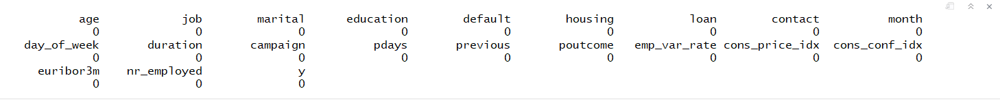

# Synthetic Minority Oversampling Technique (SMOTE) – Bank Marketing

## A. Goal  
In the dataset on Amazon Alexa reviews, we observed that imbalance in the dataset reduced the models’ accuracy to predict minority class (1 star ratings). In this exercise, we will use SMOTE to deal with an unbalanced dataset – to improve our models’ accuracy in predicting minority class.

## B. Data Source  
https://www.kaggle.com/henriqueyamahata/bank-marketing

## C. Summary  
We have used a dataset on the results of marketing calls for term deposit, made by a Portuguese bank. The data has a total of 41188 rows, of which only 4640 are 1; thus, our dataset is unbalanced. Initially, we created decision tree and logistic regression models and evaluated their performances (accuracy, sensitivity, and specificity), and then we compared these results with those of the models built on SMOTEd data.  

We used SMOTE to create a balanced dataset: we oversampled (synthetically generated more data points) the minority class and under-sampled the majority class.

- Function

**SMOTE(y ~ ., data, perc.over = 100, perc.under = 200)**  
  
The number of minority class rows are decided as follows.  
**New no. of minority class rows = Original no. of minority class rows X [1 + (perc.over/100)]**
  
The number of majority class rows are decided as follows.  
**New no. of majority class rows = [New no. of minority class rows - Original no. of minority class rows] X (perc.under/100)**  
  
We were able to see improvement in the sensitivities of the models, which is a key metric for us – as we want to predict 1s with accuracy; however, usage of SMOTE resulted in a slight decline in the specificities and thus in the overall accuracy.  
  
We will apply SMOTE function on the training data; thus, we need to split the data before using SMOTE.  

_Variable Description_

INPUT  
**age:** Client age  
**job:** Job Type  
**marital:** Marital status  
**education:** Education level  
**default:** Whether the client has defaulted  
**housing:** Whether the client has housing loan  
**loan:** Whether the client has a personal loan  
**contact:** Type of communication  
**month:** Last month of the contact  
**day_of_week:** Last contact day of the week  
**duration:** Duration of last contact (seconds)  
**campaign:** Number of times client contacted in the campaign  
**pdays:** Number of days since the client was last contacted  
**previous:** Number of times the client was contacted in earlier campaigns  
**poutcome:** Outcome of the previous marketinig campaign  
**emp.var.rate:** Employment variation rate  
**cons.price.idx:** Consumer price index  
**cons.conf.idx:** Consumer confidence index  
**euribor3m:** Euribor 3 month rate  
**nr.employed:** Number of employees 

TARGET  
**y:** Whether the client subscribed for a term deposit  

_Analysis_  

1. Check the datatypes of the variables.  

2. We looked for the missing values, but did not have any.  

3. ‘pdays’ was a numerical variable, and 999 in this column indicated that the client was never contacted. We converted this variable into a numerical one and changed 999 to ‘Not_contacted’.  

4. Only about 11.2% of the clients had responded positively to the calls.  

5. Then we looked into the education levels and the occupation of the clients.  

6. The age range of people who responded negatively is comparatively more narrow; however, the difference appeared to be marginal.  

7. People responding positively tend to stay on the call for comparatively longer duration.  

Because duration of a call is an aspect that cannot be decided before calling customers, we excluded this variable from the model; nonetheless, it might be interesting for the bank to look into whether longer duration has key elements that could be used for the training of sales teams.  

8. Clients responding positively had greater proportion of single people.  

9. More proportion of the people who said yes in the previous campaign responded positively to this campaign.  

_Machine Learning Models and Results_

1. I created Logistic Regression and Decision Tree models on the unbalanced training data and calculated their accuracies, sensitivities, and specificities.  

2. On the training data, we then used SMOTE to over-sample the minority class (1) and under-sample the majority class (0).  

  

3. I created the Logistic Regression and Decision Tree models on SMOTEd training data (balanced), and then again compared the results with the models created earlier on the unbalanced data. **The results are from the test data**.  

**Logistic Regression:**  
Sensitivity improved by about 36 percentage points.  
  

**Decision Tree:**  
Sensitivity Improved by about 29 percentage points.  

